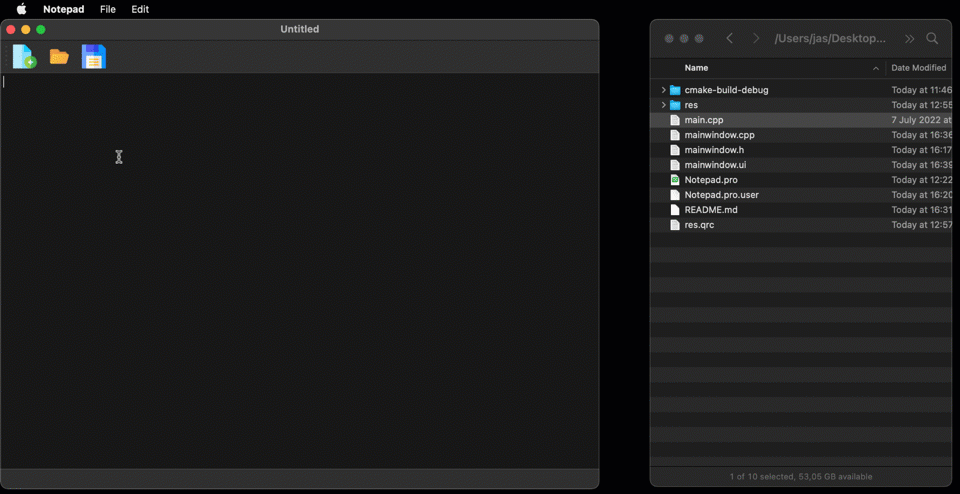

# Notepad

Simple notepad app created with Qt while following a <a href="https://www.youtube.com/watch?v=I96uPDifZ1w">tutorial</a>. \
I did some adaptations (namely adding manual signal-slot connections).

The free icons used were downloaded from <a href="https://www.flaticon.com/free-icons/save" title="save icons">here</a>, 
<a href="https://www.flaticon.com/free-icons/new" title="new icons">here</a>, and
<a href="https://www.flaticon.com/free-icons/folder" title="folder icons">here</a>.
